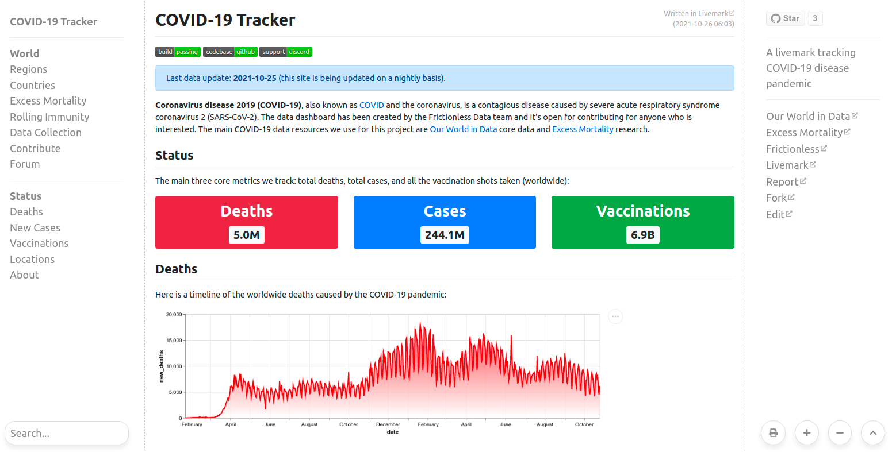
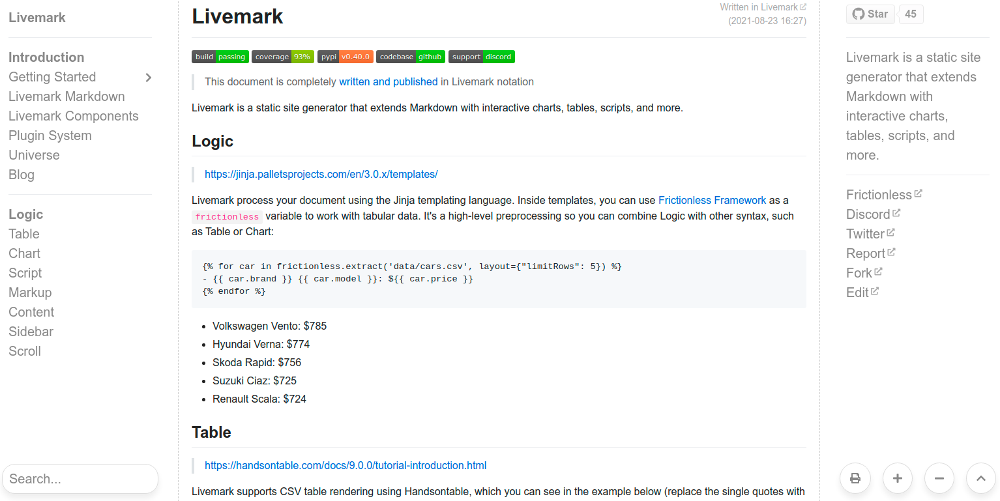

# Livemark

[](https://github.com/frictionlessdata/livemark/actions)
[](https://codecov.io/gh/frictionlessdata/livemark)
[](https://pypi.python.org/pypi/livemark)
[](https://github.com/frictionlessdata/livemark)
[](https://join.slack.com/t/frictionlessdata/shared_invite/zt-17kpbffnm-tRfDW_wJgOw8tJVLvZTrBg)

```yaml remark
type: primary
text: This documentation portal is completely <a href="https://github.com/frictionlessdata/livemark" target="_blank">written and published</a> in Livemark notation
```

Data presentation framework for Python that generates static sites from extended Markdown with interactive charts, tables, scripts, and other features.

## Purpose

- **Data Journalism**: Livemark provides a complete toolset for working with data, starting from data extraction and ending with a published website containing interactive charts, tables, and other features.
- **Software Education**: Livemark is perfectly suited for writing education materials as it uses code execution model in markdown documents. It solves a range of problems with testing and having your code example up-to-date.
- **Python Development**: Livemark can be used in software development as a helper tool for working on Python projects. It provides an ability to create documentation sites and works as a task runner.

## Examples

```html markup
<div class="container">
<div class="row">
<div class="col-sm">
  <div class="text-center border">
  <p><strong><a href="https://covid-tracker.frictionlessdata.io/">COVID-19 Tracker</a></strong></p>
  
  </div>
</div>
<div class="col-sm">
  <div class="text-center border">
  <p><strong><a href="https://livemark.frictionlessdata.io/">Livemark Docs</a></strong></p>
  
  </div>
</div>
</div>
</div>
```

## Features

```html markup
<div class="container mb-2">
<div class="row">
<div class="col-sm">
  <ul>
    <li>Open Source (MIT)</li>
    <li>Full Markdown compatibility</li>
    <li>Markdown extensions such as tables and charts</li>
  </ul>
</div>
<div class="col-sm">
  <ul>
    <li>Straight-forward command-line interface</li>
    <li>Much faster than many competitors</li>
    <li>Livereload development server</li>
  </ul>
</div>
</div>
</div>
```

```yaml remark
type: success
text: Most important Markdown features added by Livemark are listed below
```

## Logic

> https://jinja.palletsprojects.com/en/3.0.x/templates/

Livemark processes your document using the Jinja templating language. Inside templates, you can use [Frictionless Framework](https://framework.frictionlessdata.io/) as a `frictionless` variable to work with tabular data. This is a high-level data preprocessing framework so you can combine Logic with other syntax, such as Table or Chart:


```

- {{ car.brand }} {{ car.model }}: ${{ car.price }}

```



- {{ car.brand }} {{ car.model }}: ${{ car.price }}


## Table

> https://datatables.net/manual/index

Livemark supports CSV table rendering using DataTables, which you can see in the example below (replace the single quotes with back ticks). The `data` property will be read at the build stage so in addition to DataTables options you can pass a [file path](https://raw.githubusercontent.com/frictionlessdata/livemark/main/data/cars.csv) as `data` property (CSV/Excel/JSON are supported). Use `columns` property to customize fields or their order:

```yaml
'''yaml table
data: data/cars.csv
width: 600
order:
  - [3, 'desc']
columns:
  - data: type
  - data: brand
  - data: model
  - data: price
  - data: kmpl
  - data: bhp
'''
```

```yaml table
data: data/cars.csv
width: 600
order:
  - [3, 'desc']
columns:
  - data: type
  - data: brand
  - data: model
  - data: price
  - data: kmpl
  - data: bhp
```

## Chart

> https://vega.github.io/vega-lite/

Livemark supports Vega Lite visualisations rendering (to try this example, replace the single quotes with back ticks):

```yaml
'''yaml chart
data:
  url: data/cars.csv
mark: circle
selection:
  brush:
    type: interval
# other options are omitted
width: 500
height: 300
'''
```

```yaml chart
data:
  url: data/cars.csv
mark: circle
selection:
  brush:
    type: interval
encoding:
  x:
    type: quantitative
    field: kmpl
    scale:
     domain: [12,25]
  y:
    type: quantitative
    field: price
    scale:
     domain: [100,900]
  color:
    condition:
      selection: brush
      field: type
      type: nominal
    value: grey
  size:
    type: quantitative
    field: bhp
width: 500
height: 300
```

## Script

> https://www.python.org/

Livemark supports Python/Bash script execution inside Markdown. We think of this as a lightweight version of Jupyter Notebooks. Sometimes, a declarative Logic/Table/Chart is not enough for presenting data so you might also want to include the scripts. This example uses [Frictionless Framework](https://framework.frictionlessdata.io/) code to transform the dataset:

```python script
from pprint import pprint
from frictionless import Resource, transform, steps

brands = transform(
    Resource("data/cars.csv"),
    steps=[
        steps.table_normalize(),
        steps.table_aggregate(group_name="brand", aggregation={"price": ("price", max)}),
        steps.row_sort(field_names=["price"], reverse=True),
        steps.row_slice(head=5),
    ],
)
pprint(brands.read_rows())
```

## Markup

> https://getbootstrap.com/docs/5.0/getting-started/introduction/

With Livemark you can use HTML inside Markdown with Bootstrap support. Here is an example of creating a responsive grid of cards (note that if we set a `livemark-markdown` class we can use markdown inside html):

```html
'''html markup
<div class="w-50">
<div class="container">
<div class="row">
<div class="col-sm">
  <div class="markdown"></div>
  <div class="text-center">
  <p><strong>Data Package</strong></p>
  <p>A simple container format for describing a coherent collection of data in a single package.</p>
  </div>
</div>
<!-- other columns are omitted -->
</div>
</div>
</div>
'''
```

```html markup
<div style="max-width: 600px">
<div class="container">
<div class="row">
<div class="col-sm">
  
  <div class="text-center">
  <p><strong>Data Package</strong></p>
  <p>A simple container format for describing a coherent collection of data in a single package.</p>
  </div>
</div>
<div class="col-sm">
  
  <div class="text-center">
  <p><strong>Data Resource</strong></p>
  <p>A simple format to describe and package a single data resource such as a individual table or file.</p>
  </div>
</div>
<div class="col-sm">
  
  <div class="text-center">
  <p><strong>Table Schema</strong></p>
  <p>A simple format to declare a schema for tabular data. The schema is designed to be expressible in JSON.</p>
  </div>
</div>
</div>
</div>
</div>
```

---

Please read the full [Feature Reference](pages/feature-reference/general.html) to learn about all of Livemark's features.
