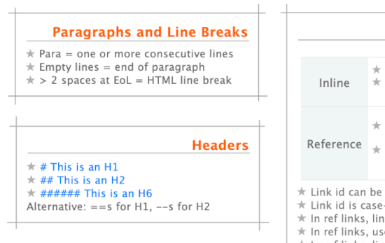
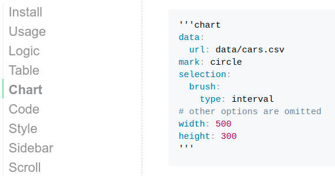
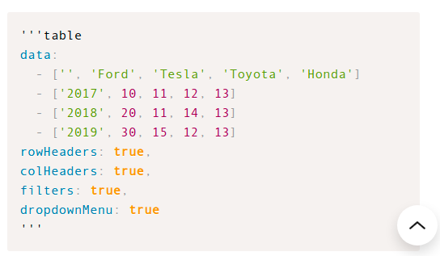

# Livemark

[](https://github.com/frictionlessdata/livemark/actions)
[](https://codecov.io/gh/frictionlessdata/livemark)
[](https://pypi.python.org/pypi/livemark)
[](https://github.com/frictionlessdata/livemark)
[](https://discord.com/channels/695635777199145130/695635777199145133)

```yaml remark
type: primary
text: This document is completely <a href="https://raw.githubusercontent.com/frictionlessdata/livemark/main/index.md">written and published</a> in Livemark notation
```

Livemark is a Python static site generator that extends Markdown with interactive charts, tables, scripts, and other features.

## Logic

> https://jinja.palletsprojects.com/en/3.0.x/templates/

Livemark process your document using the Jinja templating language. Inside templates, you can use [Frictionless Framework](https://framework.frictionlessdata.io/) as a `frictionless` variable to work with tabular data. It's a high-level preprocessing so you can combine Logic with other syntax, such as Table or Chart:


```

- {{ car.brand }} {{ car.model }}: ${{ car.price }}

```



- {{ car.brand }} {{ car.model }}: ${{ car.price }}


## Table

> https://handsontable.com/docs/9.0.0/tutorial-introduction.html

Livemark supports CSV table rendering using Handsontable, which you can see in the example below (replace the single quotes with back ticks). The `data` property will be read by [Frictionless Framework](https://framework.frictionlessdata.io/) so in addition to Handsontable options you can pass a [file path](https://raw.githubusercontent.com/frictionlessdata/livemark/main/data/cars.csv) or a resource descriptor in a Frictionless format:

```yaml
'''yaml table
data: data/cars.csv
maxRows: 10
filters: true
dropdownMenu: true
columnSorting:
  initialConfig:
    column: 2
    sortOrder: desc
width: 600
'''
```

```yaml table
data: data/cars.csv
maxRows: 10
filters: true
dropdownMenu: true
columnSorting:
  initialConfig:
    column: 2
    sortOrder: desc
width: 600
```

## Chart

> https://vega.github.io/vega-lite/

Livemark supports Vega Lite visualisations rendering (to try this example, replace the single quotes with back ticks):

```yaml
'''yaml chart
data:
  url: data/cars.csv
mark: circle
selection:
  brush:
    type: interval
# other options are omitted
width: 500
height: 300
'''
```

```yaml chart
data:
  url: data/cars.csv
mark: circle
selection:
  brush:
    type: interval
encoding:
  x:
    type: quantitative
    field: kmpl
    scale:
     domain: [12,25]
  y:
    type: quantitative
    field: price
    scale:
     domain: [100,900]
  color:
    condition:
      selection: brush
      field: type
      type: nominal
    value: grey
  size:
    type: quantitative
    field: bhp
width: 500
height: 300
```

## Map

> https://geojson.org/

Livemark supports GeoJson visualisations rendering (to try this example, replace the single quotes with back ticks):

```yaml
'''yaml map
data: data/france.json
'''
```

```yaml map
data: data/france.json
```

## Script

> https://www.python.org/

Livemark supports Python/Bash script execution inside Markdown. We think of this as a lightweight version of Jupiter Notebooks. Sometimes, a declarative Logic/Table/Chart is not enough for presenting data so you might also want to include scripts:

```python script
from pprint import pprint
from frictionless import Resource, transform, steps

brands = transform(
    Resource("data/cars.csv"),
    steps=[
        steps.table_normalize(),
        steps.table_aggregate(group_name="brand", aggregation={"price": ("price", max)}),
        steps.row_sort(field_names=["price"], reverse=True),
        steps.row_slice(head=5),
    ],
)
pprint(brands.read_rows())
```

## Markup

> https://getbootstrap.com/docs/5.0/getting-started/introduction/

With Livemark you can use HTML inside Markdown with Bootstrap support. Here is an example of creating a responsive grid of cards (note that if we set a `livemark-markdown` class we can use markdown inside html):

```html
'''html markup
<div class="w-50">
<div class="container">
<div class="row">
<div class="col-sm">
  <div class="markdown"></div>
  <div class="text-center">
  <p><strong>Data Package</strong></p>
  <p>A simple container format for describing a coherent collection of data in a single package.</p>
  </div>
</div>
<!-- other columns are omitted -->
</div>
</div>
</div>
'''
```

```html markup
<div style="max-width: 600px">
<div class="container">
<div class="row">
<div class="col-sm">
  <div class="livemark-markdown"></div>
  <div class="text-center">
  <p><strong>Data Package</strong></p>
  <p>A simple container format for describing a coherent collection of data in a single package.</p>
  </div>
</div>
<div class="col-sm">
  <div class="livemark-markdown"></div>
  <div class="text-center">
  <p><strong>Data Resource</strong></p>
  <p>A simple format to describe and package a single data resource such as a individual table or file.</p>
  </div>
</div>
<div class="col-sm">
  <div class="livemark-markdown"></div>
  <div class="text-center">
  <p><strong>Table Schema</strong></p>
  <p>A simple format to declare a schema for tabular data. The schema is designed to be expressible in JSON.</p>
  </div>
</div>
</div>
</div>
</div>
```

## Content

> https://guides.github.com/features/mastering-markdown/

Livemark supports Github Flavoured Markdown so you can use familiar notation:



## Sidebar

> https://tscanlin.github.io/tocbot/

Livemark provides an automatically generated table of contents:



## Scroll

> https://azrsix.github.io/ue-scroll-js/

Livemark provides a scroll-to-top button when you scroll down your document:


